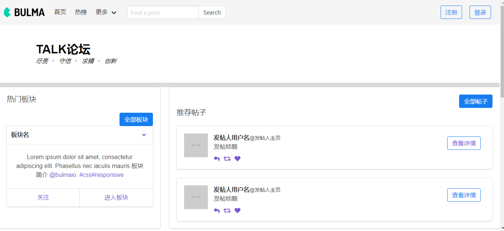
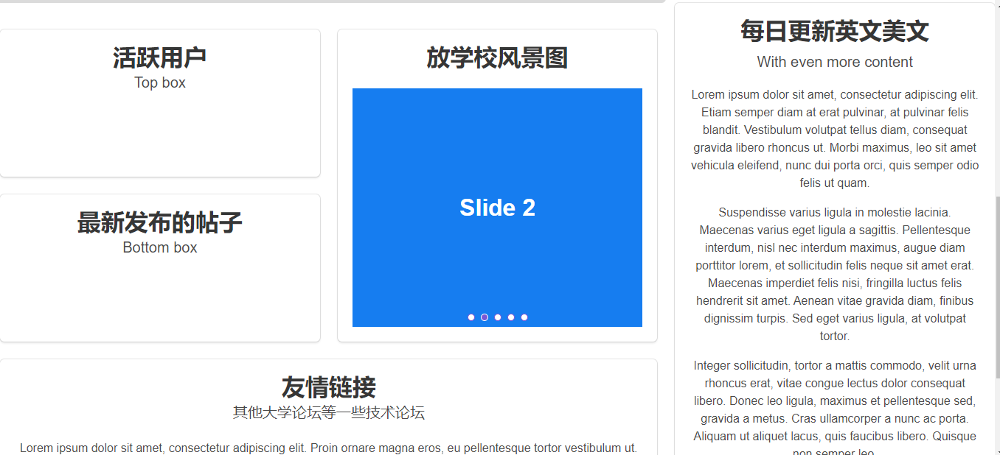
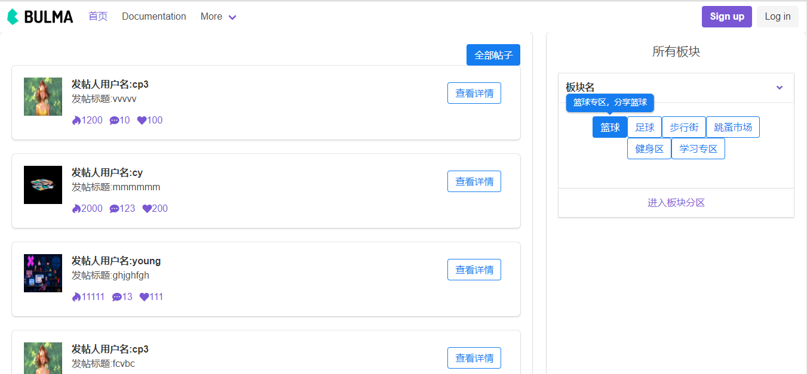
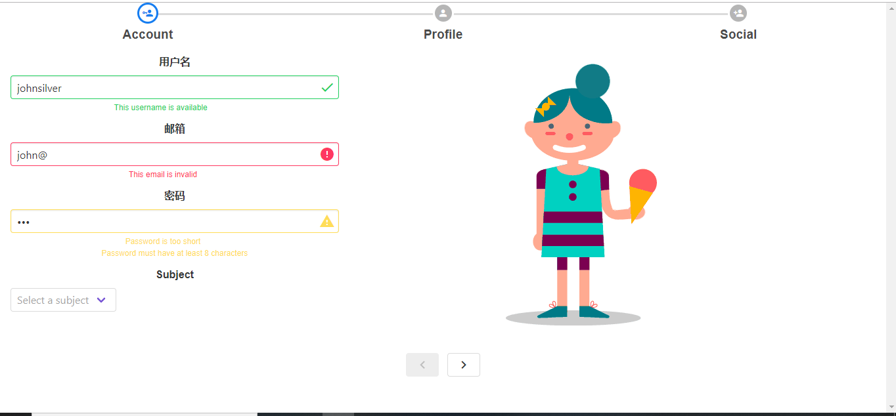
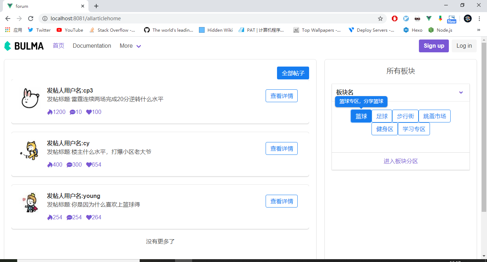
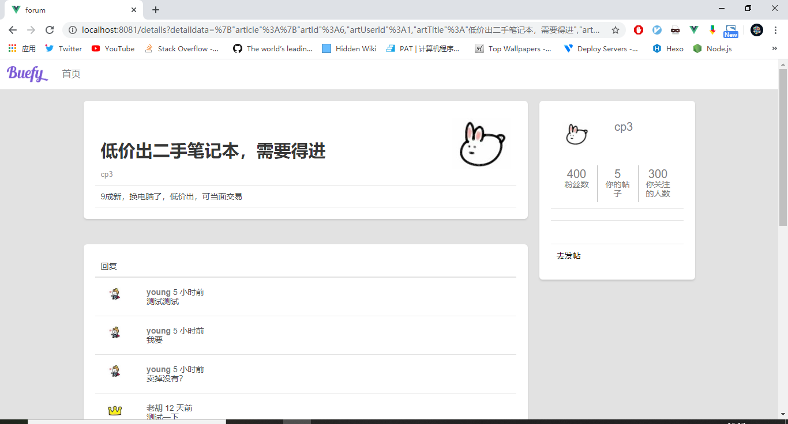
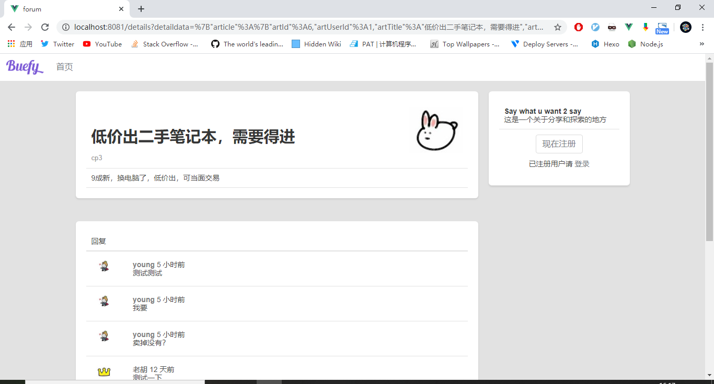
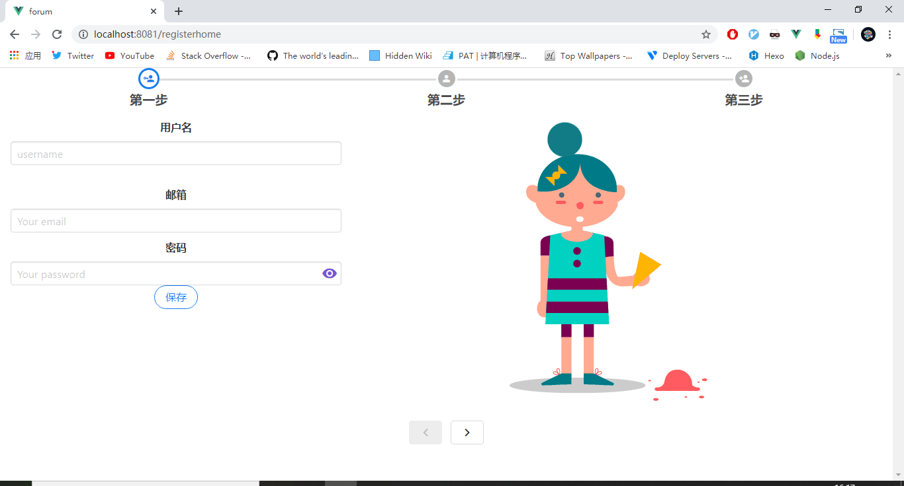
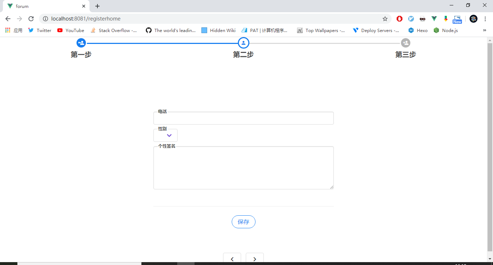
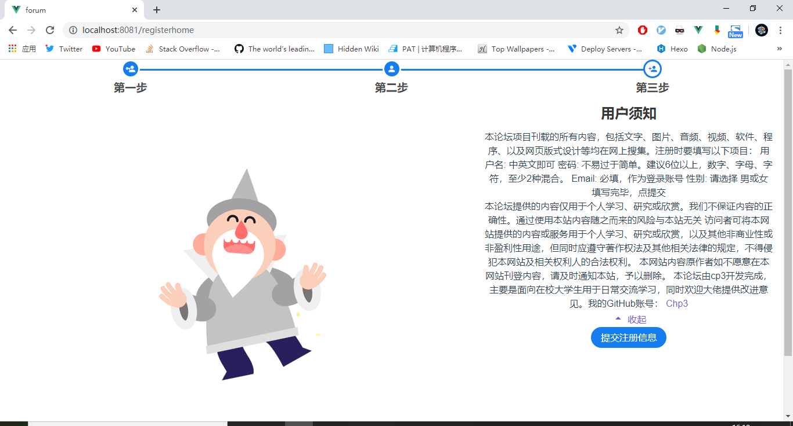

# forum

所用到的技术栈

`springboot` 

`springsecurity`

`vue`

`vuex`

`axios`

`vue-router`

`element-ui`

`buefy-ui`

`mysql` 

后端项目地址：https://github.com/cp3geek/universityforum

后台项目跑起来再运行前端项目，不然获取不到数据，配置文件中更改数据库信息


帖子详情界面和发帖，登录界面使用v2ex论坛的样式
基本功能开发完了，但是有很多缺陷，先让项目跑起来再慢慢优化，希望各位大佬能给一些指导意见


项目部分截图
 
 
 
 
 
 
 
 
 
 
 

## Project setup（安装依赖）
```
yarn install或者npm install
```

### Compiles and hot-reloads for development（启动项目）
```
yarn run dev 或者npm run dev
```

### Compiles and minifies for production（打包）
```
yarn run build 或者npm run build
```


